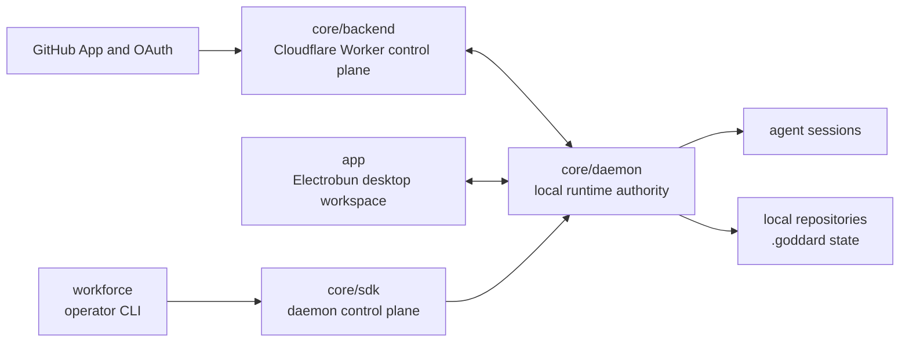

# Architecture

This document is a contributor-facing map of Goddard's internals. It explains
how the monorepo fits together and where to read next.

Canonical product behavior and architectural intent live in [`spec/`](./spec/).
If this file disagrees with the spec, update this file from the spec rather than
treating it as an override.

## System Model

Goddard connects local repository work, GitHub identity and events, and
daemon-managed AI execution.

The backend owns remote platform authority. The daemon owns local runtime
authority. The SDK is the stable programmatic daemon-control surface. The
desktop app is the primary human workspace and keeps privileged daemon and OS
access behind its trusted host boundary.

## Runtime Responsibilities

| Area | Path | Owns | Boundary |
| --- | --- | --- | --- |
| Product spec | [`spec/`](./spec/) | Mission, behavior, architecture intent, ADRs, conceptual data flows | Not a code tour or implementation changelog |
| Backend control plane | [`core/backend`](./core/backend/) | GitHub OAuth sessions, managed pull request state, webhooks, SSE fan-out, backend persistence | No separate shared backend-client package; daemon consumes backend route modules through `rouzer` |
| Shared schemas | [`core/schema`](./core/schema/) | Zod schemas for backend, daemon IPC, config, and workforce contracts | Does not own runtime behavior |
| IPC helpers | [`core/ipc`](./core/ipc/) | Typed IPC schema declarations, clients, transports, and server helpers | Does not decide daemon capability shape |
| Daemon client | [`core/daemon/client`](./core/daemon/client/) | Low-level daemon URL, TCP transport, and injected daemon IPC client helpers | Use the SDK for stable daemon actions |
| SDK | [`core/sdk`](./core/sdk/) | Stable daemon-backed auth, PR, session, action, loop, and workforce methods | Not a general backend real-time client |
| Daemon | [`core/daemon`](./core/daemon/) | Local background runtime, sessions, PR feedback handling, loop runtime, workforce runtime, IPC server | Clients observe and control daemon-owned runtimes; they do not own parallel runtime state |
| Desktop app | [`app`](./app/) | Electrobun host, Preact workspace UI, embedded daemon lifecycle in packaged builds | Browser code talks through host RPC and must not bypass the trusted host boundary |
| Workforce CLI | [`workforce`](./workforce/) | Headless operator surface for repository-scoped multi-agent orchestration | Thin daemon-backed client, not runtime owner |
| Config | [`core/config`](./core/config/) | JSON-safe persisted config merge helpers and precedence | Does not load prompt frontmatter or own runtime effects |
| Paths | [`core/paths`](./core/paths/) | Pure Goddard path names and path resolution | Does not read, write, persist tokens, or open databases |
| Review sync | [`core/review-sync`](./core/review-sync/) | Git-only local review branch synchronization for agent-owned branches | Separate from daemon worktree sync |
| Sprint branch | [`core/sprint-branch`](./core/sprint-branch/) | Git-private sprint branch state and safe sprint branch transitions | Human landing remains interactive and explicit |
| Worktree plugins | [`core/worktree-plugin`](./core/worktree-plugin/) | Shared plugin contract for linked Git worktree providers | Plugins must provide real linked worktrees |

## Main Data Flows

### Authentication

1. A desktop or SDK host requests a protected action.
2. The backend starts a GitHub OAuth Device Flow session.
3. The host presents the verification URL and user code.
4. The backend records the authorized session.
5. The host stores the token using host-appropriate storage.

Read more: [`spec/core/data-flows.md`](./spec/core/data-flows.md).

### Managed Pull Request Feedback

1. Goddard creates or records a managed pull request under delegated GitHub
   authority.
2. GitHub sends pull request or review events to the backend webhook.
3. The backend maps the event to the owning Goddard user and streams it over the
   authenticated managed pull request event stream.
4. The local host updates visible state or starts daemon-managed PR feedback
   handling.

Read more: [`spec/daemon/pr-feedback.md`](./spec/daemon/pr-feedback.md).

### Daemon Control

1. Local clients communicate with the daemon through typed IPC.
2. `@goddard-ai/sdk` exposes the stable method surface for daemon-backed
   behavior.
3. App, CLI, and custom integrations remain thin clients over the same daemon
   contracts.

Read more: [`spec/adr/001-sdk-first-architecture.md`](./spec/adr/001-sdk-first-architecture.md)
and [`core/sdk/README.md`](./core/sdk/README.md).

### Workforce Orchestration

1. An operator initializes repository-local workforce intent.
2. The daemon reconstructs workforce state from durable repository-local files.
3. Work is queued through daemon-backed clients.
4. The daemon starts fresh agent sessions for handled requests and validates
   attributable repository changes before advancing the queue.
5. Operators inspect shared status through the daemon, SDK, or thin CLI.

Read more: [`spec/daemon/workforce.md`](./spec/daemon/workforce.md) and
[`workforce/README.md`](./workforce/README.md).

## Architectural Rules

- `spec/` is canonical for behavior and intent.
- Daemon control capabilities live in `@goddard-ai/sdk` first; app, CLI, and
  custom hosts should not invent parallel daemon-control contracts.
- User-facing `app/` capabilities that depend on shared data loading, shared data
  mutation, or system configuration need matching `core/sdk/` support.
- The desktop app keeps privileged OS and daemon access behind the trusted
  Electrobun host boundary.
- Backend-owned real-time delivery is separate from SDK daemon-control concerns.
- The daemon owns lifecycle and recovery for daemon-managed local runtimes.
- Workforce orchestration and PR feedback handling are separate daemon runtime
  domains, even when hosted by the same daemon process.
- Shared schemas and typed IPC contracts exist to prevent drift between hosts.
- Package READMEs define package boundaries and integration surfaces; glossaries
  define domain terminology.

## Where To Read Next

- Start with [`spec/README.md`](./spec/README.md) for mission, product pillars,
  and usage modes.
- Read [`spec/core/architecture.md`](./spec/core/architecture.md) for canonical
  platform architecture.
- Read [`spec/core/data-flows.md`](./spec/core/data-flows.md) for conceptual
  end-to-end sequences.
- Read ADRs in [`spec/adr/`](./spec/adr/) for decision history.
- Read a package's `README.md` before changing its public boundary.
- Read a package's `glossary.md` before changing terminology, states, roles,
  identifiers, or ownership rules.
