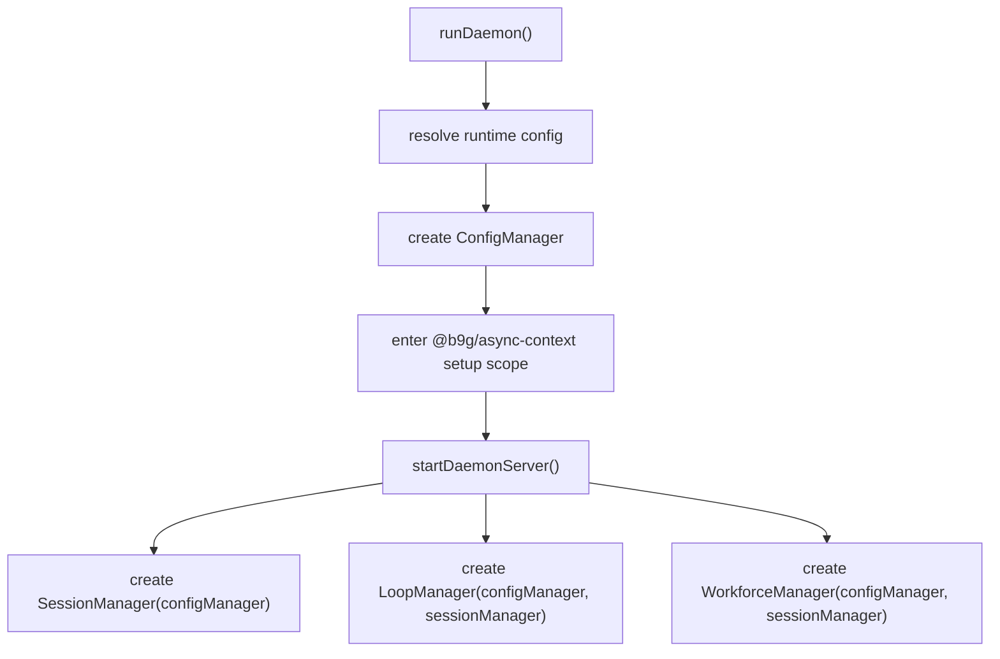
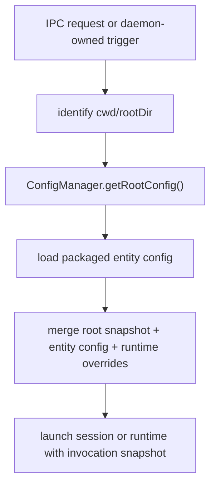

# Daemon User Config Hot Reload Design

## Overview

This document defines a daemon-side design for reloading persisted user configuration without restarting the daemon process. The target subsystem is `@goddard-ai/daemon`, with changes centered on daemon startup, config resolution, and the boundaries that launch daemon-managed work.

The design introduces one daemon-scoped config manager that owns persisted config loading, caching, validation, and reload. The daemon setup path threads that manager through startup using `@b9g/async-context` as the async-context compatibility layer, then long-lived managers retain an explicit reference to it after construction.

For filesystem watching, the daemon uses `chokidar` rather than raw runtime watch APIs.

## Context

Today the daemon resolves persisted config in a piecemeal way:

- Root config is read directly from disk by `core/daemon/src/resolvers/config.ts`.
- Action and loop resolution each load merged root config on demand.
- PR feedback one-shots resolve the default agent without daemon-owned persisted config context.
- Session launch accepts optional config, but daemon startup does not provide a single authoritative config source.

This has two problems:

- Persisted config changes require process restart or incidental re-resolution in the right path.
- The daemon has no single authority for config freshness, validation failure handling, or watcher lifecycle.

## Goals

- Let a running daemon adopt valid persisted config changes without restart.
- Keep behavior aligned with `spec/configuration.md`: config resolves before execution begins and each invocation runs against a stable snapshot.
- Centralize persisted config loading, validation, caching, and reload in one daemon-owned component.
- Ensure new daemon-managed work sees fresh config consistently across session creation, action runs, loop starts, workforce session launches, and PR feedback one-shots.
- Use `@b9g/async-context` to thread the config manager through daemon setup without turning ambient global state into the runtime contract.
- Keep daemon-owned async context behind a local wrapper so future platform-native async-context APIs can replace the package with minimal churn.
- Use `chokidar` as the daemon's file-watch backend so config reload behavior stays stable across current and future host runtime APIs.

## Non-Goals

- Mutating the config of an already-running session after launch.
- Hot-editing the live behavior of an already-running loop runtime or active workforce request.
- Changing the persisted config schema or precedence model.
- Designing app-facing UX for config editing or reload status.
- Making non-daemon consumers depend on daemon-owned async context.

## Assumptions and Constraints

- Persisted config precedence remains `global -> local -> entity -> runtime override`.
- The daemon is the lifecycle authority for daemon-managed work and is the right place to own persisted config refresh.
- Invalid persisted edits must not replace the last known good config.
- Local config is repository-scoped, so repository watchers should only exist for repositories the daemon has actually touched.
- The repository is pre-alpha, so forward-looking cleanup is acceptable and backward compatibility is not required.

## Terminology

- Persisted config: global user config, repository-local config, and packaged entity config stored on disk.
- Root config snapshot: one validated merged view of global and local config for a specific repository context at a point in time.
- Config manager: the daemon-owned component that reads, validates, caches, watches, and serves persisted config snapshots.
- Setup context: the daemon startup context carried with `@b9g/async-context` while the daemon constructs its runtime graph.
- Invocation snapshot: the resolved config view used by one new unit of work at its start boundary.

## Proposed Design

### Core Model

Add a daemon-scoped `ConfigManager` with three responsibilities:

1. Load and validate persisted config from disk.
2. Cache the last valid snapshot per relevant scope.
3. Observe file changes and atomically promote new snapshots when validation succeeds.

The daemon creates exactly one manager during startup. Startup code enters an async-context setup scope, implemented with `@b9g/async-context`, that contains:

- resolved daemon runtime config
- config manager

Construction code for the daemon server and its child managers reads that setup context once and stores explicit references to the config manager on the constructed objects. The async-context package is therefore a setup transport, not the steady-state runtime API.

### Async-Context Compatibility Layer

The daemon should not import `node:async_hooks` directly for this feature. Instead it should define one local async-context helper backed by `@b9g/async-context`.

That helper should expose only the narrow operations the daemon needs:

- create the setup context store
- enter a setup scope for daemon construction
- read the current setup context during construction

This keeps the dependency boundary small and preserves the option to swap the backing implementation later if Bun, Node, or shared Goddard infrastructure standardizes on a different async-context API.

### Scope of Reload

Reload applies to future work only:

- new `sessionCreate` calls
- new `actionRun` calls
- new `loopStart` calls
- new workforce-handled session launches
- new PR feedback one-shots

Reload does not retroactively change:

- live daemon sessions that already started
- loop runtimes that are already running
- an already-dispatched workforce request attempt

This preserves the existing spec rule that execution starts from a stable resolved config.

### Watch Model

The config manager watches:

- the global config path immediately at daemon startup
- repository-local config paths lazily, when the daemon first resolves config for a repository root

Watch registration, event handling, and teardown should be implemented directly inside the config manager with `chokidar`.

Entity config for actions and loops remains on-demand at resolution time in the first version. The config manager does not watch entity config files and does not treat entity-config reload as part of the daemon user-config hot-reload scope.

## Interfaces and Contracts

### `ConfigManager`

The daemon package should define a config-manager interface roughly along these lines:

```ts
type RootConfigSnapshot = {
  globalRoot: string
  localRoot: string
  config: UserConfig
  version: number
  loadedAt: string
}

type ConfigManager = {
  getRootConfig(cwd?: string): Promise<RootConfigSnapshot>
  getLastKnownRootConfig(cwd?: string): RootConfigSnapshot | null
  ensureWatching(cwd: string): Promise<void>
  close(): Promise<void>
}
```

Contract:

- `getRootConfig()` returns the latest validated snapshot for the repository context.
- If no snapshot exists yet, it performs the initial load.
- If a reload is in progress, callers receive either the new validated snapshot or the previous validated snapshot, never a partial state.
- Validation failures do not evict the last good snapshot.
- `version` increases monotonically per successful promotion.
- Watchers owned by the manager use `chokidar` and are closed by `ConfigManager.close()`.
- The config manager may debounce or use `awaitWriteFinish`-style behavior to avoid promoting half-written config edits.

### Setup Context

The daemon package should define one async-context store for `DaemonSetupContext`, backed by `@b9g/async-context`:

```ts
type DaemonSetupContext = {
  runtime: ResolvedDaemonRuntimeConfig
  configManager: ConfigManager
}
```

Contract:

- The setup context is available only during daemon construction.
- Runtime code must not depend on calling `getStore()` deep inside request handling to discover config.
- Managers capture the config manager explicitly during construction.
- The daemon should access the store through a local wrapper module rather than importing the package at each call site.

### Resolver Integration

Action and loop resolvers should accept a config-manager seam or equivalent loader callbacks instead of reading merged root config directly from disk.

Contract:

- Action resolution uses the current root snapshot for the request `cwd`, then reads packaged action config and applies precedence.
- Loop resolution uses the current root snapshot for the request `rootDir`, then reads packaged loop config and applies precedence.
- Session launch paths that need root defaults such as worktree defaults or registry values should fetch them through the config manager at launch time.

## Behavioral Semantics

### Initial Startup

1. Daemon resolves runtime launch config.
2. Daemon creates the config manager.
3. Daemon enters the setup async-context scope with runtime config and config manager.
4. Daemon constructs the IPC server, session manager, loop manager, and workforce manager.
5. Long-lived managers capture explicit config-manager references.
6. Global config watching begins before the daemon starts serving requests.

### Root Config Resolution

For a request associated with a repository context:

1. Determine the repository-sensitive config root for the incoming `cwd` or `rootDir`.
2. Ask the config manager for the current root snapshot.
3. If no local watcher exists for that repository, register one.
4. Merge entity config and runtime overrides on top of the returned root snapshot.
5. Launch work using that resolved invocation snapshot.

### Reload on File Change

1. A watched config file changes.
2. The config manager reads the changed file set and validates the resulting snapshot.
3. If validation succeeds, it atomically promotes the new snapshot and increments its version.
4. If validation fails, it logs the failure and keeps the prior snapshot active.
5. Future work uses the promoted snapshot; in-flight work remains unchanged.

`chokidar` event noise such as repeated change notifications for the same write burst should be absorbed by config-manager coalescing logic so one persisted edit does not cause materially duplicated reload work.

### Concurrency and Consistency

- Concurrent requests for the same repository context must not trigger conflicting promotions.
- Snapshot promotion is atomic at the manager level.
- Callers never observe a half-updated merged config.
- Two requests that start on opposite sides of a promotion may legitimately run with different snapshots.

### Default-Agent Semantics

Default-agent selection must become config-manager aware:

- If the current root snapshot specifies an explicit agent, use it.
- Otherwise fall back to executable discovery and then the hardcoded final default.
- PR feedback one-shots must resolve their default agent through the current repository snapshot instead of using config-free fallback behavior.

## Architecture and End-to-End Flow

### Construction Flow



### Request-Time Flow for Action or Loop Resolution



### PR Feedback One-Shot Flow

1. Daemon receives managed PR feedback.
2. Daemon resolves the project directory.
3. Daemon asks the config manager for the current root snapshot for that directory.
4. Daemon resolves the default agent from that snapshot.
5. Daemon creates the one-shot session through the IPC path.

## Alternatives and Tradeoffs

### Alternative 1: Keep Ad Hoc File Reads

Rejected because:

- each entry point would keep its own reload behavior
- validation failure handling would stay inconsistent
- watch lifecycle would be duplicated or absent

Tradeoff:

- lower immediate refactor cost
- much weaker correctness and operability

### Alternative 2: Use Async Context as the Runtime Config Lookup API

Rejected because:

- it would hide core dependencies
- request-time behavior would become harder to reason about and test
- long-lived background tasks could accidentally rely on ambient context propagation

Tradeoff:

- narrower constructor changes
- worse explicitness and weaker local reasoning

### Alternative 3: Use Raw Host File-Watch APIs

Rejected for the first version because:

- watch semantics vary across runtimes and operating systems
- rename, atomic-save, and partial-write behavior would need more daemon-local normalization
- the user explicitly wants a dependency choice that is more compatible with future API shifts

Tradeoff:

- one less dependency
- more watch-behavior risk and more daemon-owned compatibility code

### Alternative 4: Auto-Restart Active Loops on Config Change

Rejected for the first version because:

- it changes task lifecycle semantics
- it can interrupt unattended work unexpectedly
- it requires per-runtime restart policy that the spec does not yet define

Tradeoff:

- fresher config for active runtimes
- substantially more surprising behavior

## Failure Modes and Edge Cases

- Invalid JSON or schema-invalid persisted config: keep serving the last valid snapshot and emit a daemon log event for the failure.
- Config deleted after a valid load: treat deletion as removal of that layer, validate the new merged result, and promote only if valid.
- Repository local config changes for a repository the daemon has never touched: no watcher is required yet because no daemon-managed work depends on it.
- Rapid successive file writes: debounce or serialize reload work per watched scope so the manager promotes only complete validated snapshots.
- Watcher failure or OS limit exhaustion: daemon continues serving the last valid snapshot and logs degraded reload coverage.
- Concurrent first access for the same repository: coalesce initial loads so only one load populates the cache.
- Atomic-save editor behavior that appears as remove plus add or rename plus change: `chokidar` events must still resolve to one reload attempt against the final on-disk state.

## Testing and Observability

### Test Coverage

Initial implementation should add only critical tests.

- One focused config-manager test should prove the core safety contract: a valid persisted edit promotes a new snapshot, and an invalid persisted edit preserves the last good snapshot.
- One daemon integration test should cover a representative standard launch path, preferably `actionRun`, and prove `config A -> edit -> config B` affects future work only.
- One daemon integration test should cover the PR feedback one-shot path so default-agent resolution is verified on the daemon-owned automation path as well.
- Do not add a broad entry-point coverage matrix in the first version. `sessionCreate`, `loopStart`, and workforce-specific reload tests should wait until implementation reveals distinct logic or regression risk.
- Do not add separate async-context or `chokidar` behavior tests unless the implementation introduces non-trivial logic that is not already covered by the critical path tests.

### Observability

Add daemon log events for:

- config watcher started
- config reload succeeded
- config reload failed
- config snapshot promoted
- config watcher degraded or closed

Recommended fields:

- scope path or repository root
- snapshot version
- changed layer set
- error message when applicable

Logs are sufficient for the first version. The daemon does not need a client-facing reload-status surface until a stronger operational need appears.

## Rollout and Migration

- Introduce the config manager behind the daemon package only; no schema migration is needed.
- Introduce `@b9g/async-context` behind a local daemon wrapper instead of importing it broadly across the package.
- Add `chokidar` to `@goddard-ai/daemon` and let the config manager own watcher lifecycle directly.
- Move resolver entry points to manager-backed root snapshot loading one path at a time.
- Update one-shot launch to use manager-backed default-agent resolution in the same change so daemon-owned automation matches IPC-driven behavior.
- Remove direct daemon-side calls that read merged root config from disk after the manager is in place.

## Open Questions

None at this time.

## Ambiguities and Blockers

- AB-1 - Resolved - Scope of hot reload
  - Affected area: Behavioral Semantics
  - Issue: It was unclear whether hot reload should mutate already-running work.
  - Why it matters: Loop and session lifecycle behavior would otherwise be ambiguous.
  - Next step: None. This design defines reload as affecting future work only.

- AB-2 - Resolved - Entity config watch coverage
  - Affected area: Interfaces and Contracts
  - Issue: The first version needed a clear boundary for packaged action and loop config.
  - Why it matters: Some users may expect all persisted config files to refresh uniformly.
  - Next step: None. This design keeps entity config as on-demand reads in the first version.

- AB-3 - Resolved - File-watch backend choice
  - Affected area: Watch Model / Rollout
  - Issue: The design previously left the watch backend implicit.
  - Why it matters: Watch behavior and compatibility affect reload correctness.
  - Next step: None. This design now chooses direct `chokidar` ownership inside the config manager.

- AB-4 - Resolved - Reload status reporting surface
  - Affected area: Observability
  - Issue: It was unclear whether reload status needed a client-facing surface in the first version.
  - Why it matters: Extra surfaces increase implementation scope and maintenance cost.
  - Next step: None. This design treats daemon logs as sufficient for the first version.
